# Microsoft Foundry (Azure AI Foundry)

Microsoft Foundry is Azure's platform for building and running AI agents. This guide connects Foundry to the Airia AI Gateway as an **admin-connected model**, so Foundry prompt agents send their model requests through Airia.

## Overview

Once connected, any Foundry prompt agent can use models served by the Airia AI Gateway, with every request covered by Airia's guardrails, data loss prevention, and observability. This guide sets up one connection with two example models: Claude Sonnet 5.5 (with tools) and GPT-6.1 Sol (text chat only).

## Prerequisites

- An Airia account with access to the AI Gateway
- An Airia AI Gateway API key
- A Microsoft Foundry project, with the **Foundry User** role (or higher) on the project and **Contributor** on the resource group

## Setup

### Part 1: Configure the Airia AI Gateway

1. In Airia, go to **Gateway** > **AI Gateway** and open (or create) the configuration you'll use for Foundry. On the **Models** tab, add the models you want Foundry to use.

   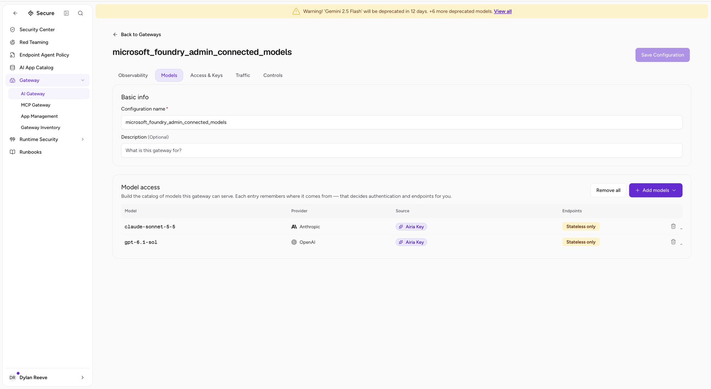

2. **OpenAI models only:** Foundry sends its own project name in an `openai-project` header, which OpenAI rejects. On the **Traffic** tab, select **Add rule** to create a routing rule that removes it.

   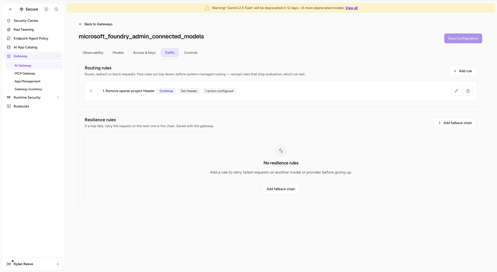

3. Configure the rule as follows, then select **Save rule**:
   - **Rule Type:** `Header`
   - **Key Operator:** `Equals`, **Header Key Pattern:** `openai-project`, **Case Sensitivity:** `Case Insensitive`
   - **Action type:** `Set Header`, **Header Name:** `openai-project`, **Action:** `Remove`
   - **After this rule matches:** `Continue to later rules`

   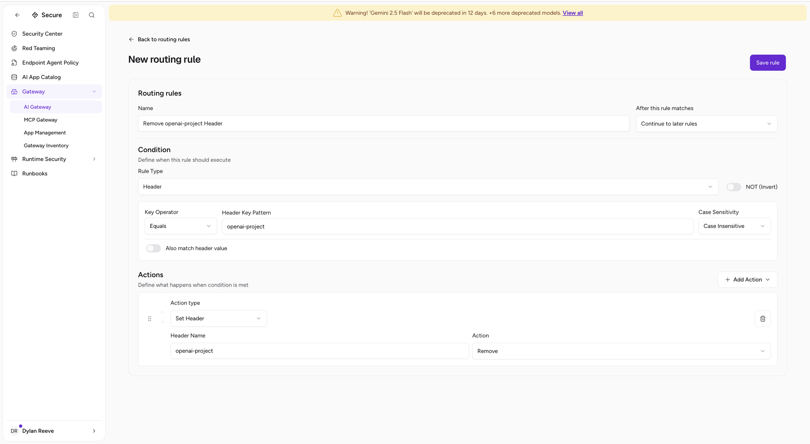

### Part 2: Add the admin-connected model in Foundry

4. In Microsoft Foundry, select **Manage**, then **Project details**. Open the **Admin-connected models** tab and select **Add**.

   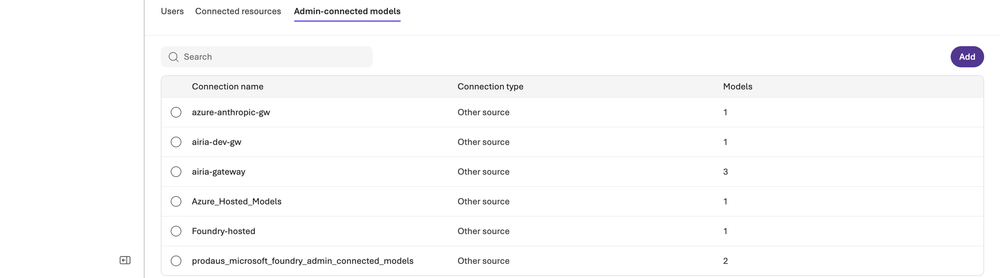

5. Under **Connection type**, choose **Other source**, then select **Select**.

   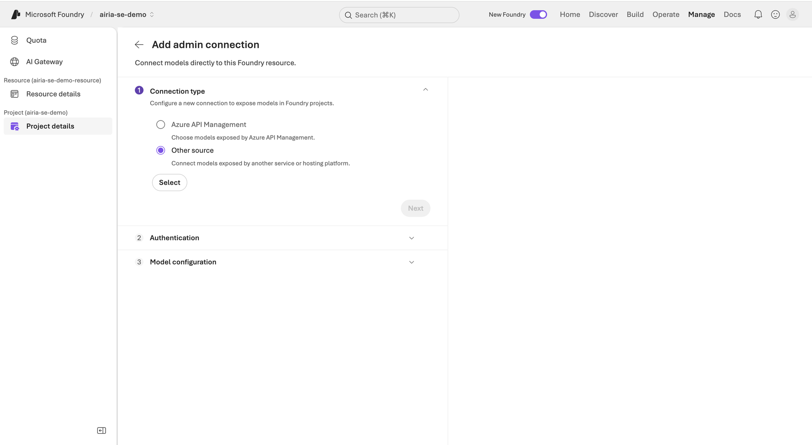

6. In Airia, copy your gateway URL using the **Gateway URL** button on the **AI Gateway** page.

   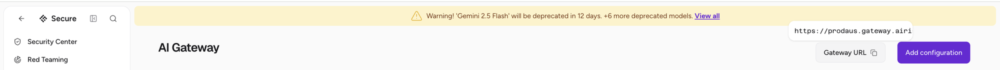

7. Back in Foundry, enter a **Connection name** and paste the gateway URL as the **Base URL**, adding `/v1` to the end. Select **Select**.

   ```text
   https://<your-gateway-url>/v1
   ```

   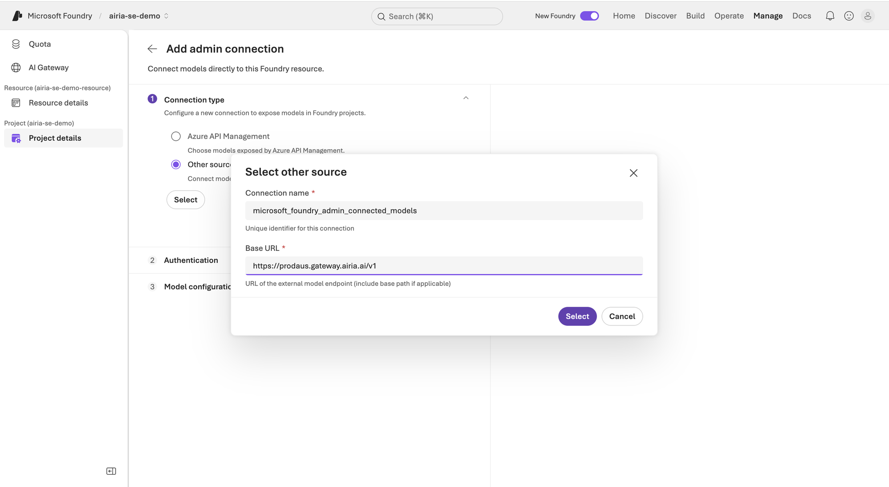

8. Under **Authentication**, choose **API key** and fill in:
   - **API key:** your Airia AI Gateway API key
   - **API key header name:** `x-api-key`
   - **API key header value:** `{api_key}`

   Select **Next**.

   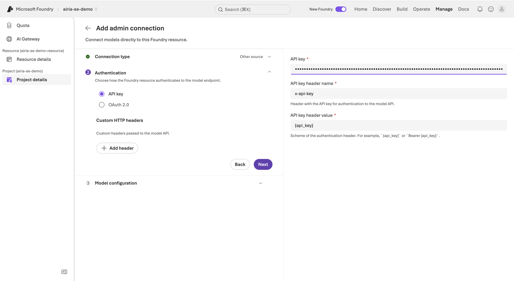

9. Under **Model configuration**, choose **Static model list** and select **Add model**.

   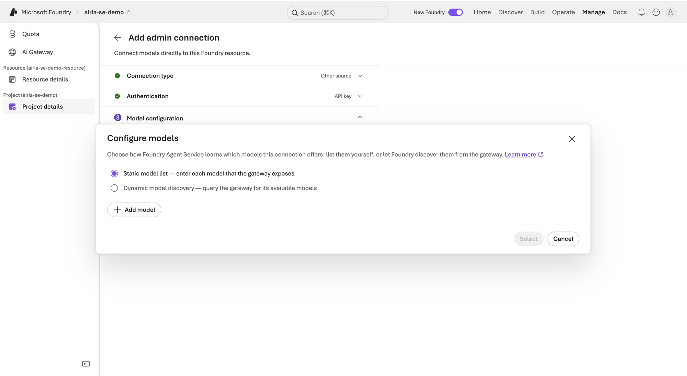

10. Add each model. Use the model name exactly as it appears in Airia, and set **Format** to match the provider:
    - **Anthropic models:** Format `Anthropic API` (for example, `claude-sonnet-5-5`)
    - **OpenAI models:** Format `OpenAI` (for example, `gpt-6.1-sol`)

    Leave **Version** empty, then select **Save**.

    

    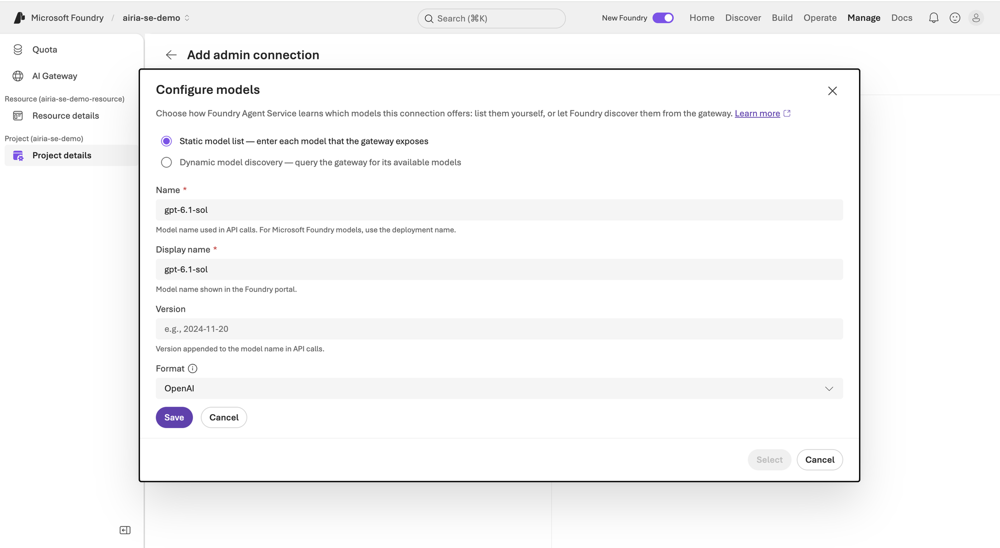

11. Select **Select**, then **Connect** to create the connection.

### Part 3: Create a prompt agent

12. Go to **Build** > **Agents** and create a new prompt agent.
13. Under **Model**, choose a model from your new connection. These appear as `<connection-name>/<model-name>`.
14. Set up tools based on the model:
    - **Anthropic models:** tools such as **Web search** work as normal.
    - **OpenAI models (GPT-5.4 and newer):** remove all tools. See [Limitations](#limitations).
15. Select **Save**.

## Example

A Claude Sonnet 5.5 agent with **Web search** enabled, routed through the Airia AI Gateway:

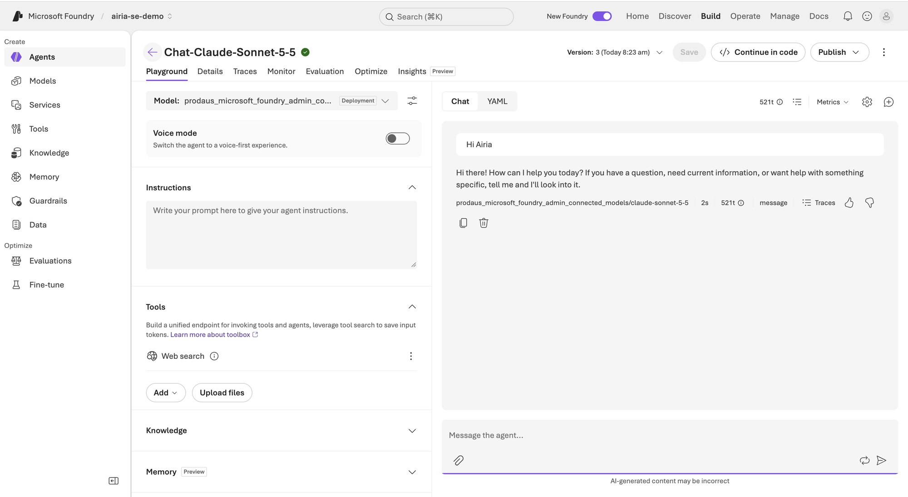

A GPT-6.1 Sol agent with no tools, routed through the Airia AI Gateway:

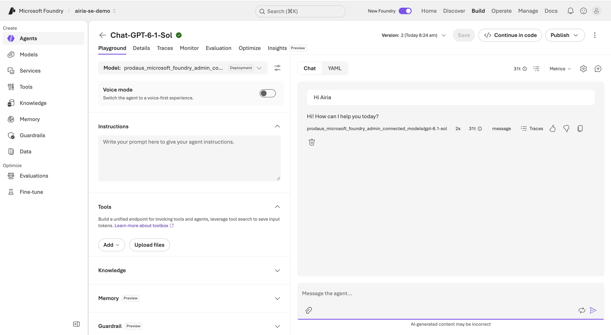

Every request from these agents appears in Airia under **Audit** > **Gateway Monitoring**. Each call shows the guardrail policies evaluated, the tool calls made, and the full request, including the agent's tool definitions:

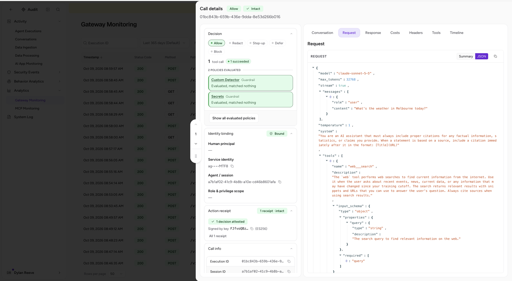

## Supported features

- [x] Streaming
- [x] Tool / function calling (Anthropic models; not newer OpenAI models, see below)
- [ ] Structured output (not tested)
- [x] Model switching via the gateway

## Limitations

- **No tools on newer OpenAI models.** Foundry calls OpenAI-format models using the Chat Completions API. Starting with GPT-5.4, OpenAI only supports tool calling with reasoning through the Responses API, so any tool (including Web search) causes a `Function tools with reasoning_effort are not supported` error. Foundry also doesn't send a `reasoning_effort` of `none`, even when selected. Use an Anthropic model for agents that need tools. This is a Microsoft Foundry limitation.
- **The `openai-project` header rule is required for OpenAI models.** Without it, OpenAI returns `Invalid project ID '<your-foundry-project-name>'`.
- **Prompt agents only.** Admin-connected models currently only work with Foundry prompt agents.
